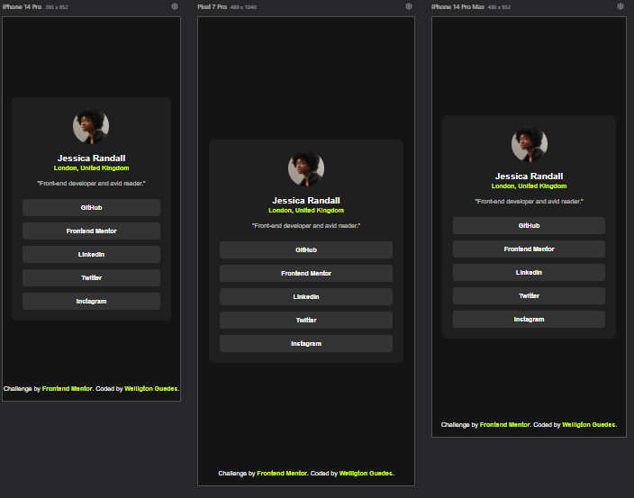
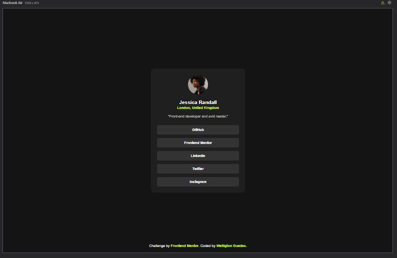

# Social Links Profile

Este projeto foi criado como parte do desafio do Frontend Mentor para construir um componente de Social Links Profile. O foco principal foi criar uma solução simples e responsiva usando apenas HTML e CSS.

## Visão Geral
O objetivo deste desafio é construir um card de Social Links Profile que seja responsivo em diferentes resoluções de tela, mantendo um design consistente e seguindo boas práticas de semântica e acessibilidade.

### Versão Mobile:


### Versão Desktop:



## Links
- [Live Site](https://github.com/WellingtonGuedesDev/Social-links-profile)
- [Frontend Mentor Challenge](https://www.frontendmentor.io/challenges/social-links-profile-card-6e57b1908349eef05a640a41)

## Tecnologias Utilizadas
- HTML5: para a estrutura semântica da página.
- CSS3: para a estilização, incluindo layouts flexíveis e responsividade.
- Google Fonts: para a fonte Inter.

## Funcionalidades
- Design responsivo que se adapta a diferentes tamanhos de tela.
- Estrutura semântica utilizando tags HTML corretas para acessibilidade.
- Layout centralizado e simétrico, adequado tanto para mobile quanto para desktop.

## Estrutura do Projeto
A estrutura do projeto segue um layout simples, com os seguintes arquivos principais:

- `index.html`: arquivo principal que define a estrutura básica da página.
- `assets/styles/variables.css`: arquivo de variáveis de cores e fontes.
- `assets/styles/style.css`: arquivo de estilos que estiliza a página.
- `assets/images/`: diretório que contém as imagens utilizadas no projeto.

## Como Rodar o Projeto

acesse o link do deploy: 

ou

```bash
git clone https://github.com/WellingtonGuedesDev/Social-links-profile.git
```
Abra o arquivo index.html no seu navegador.

## Créditos
Este projeto foi desenvolvido por Wellington Guedes como parte do desafio Frontend Mentor. Design e especificações fornecidas pela plataforma.